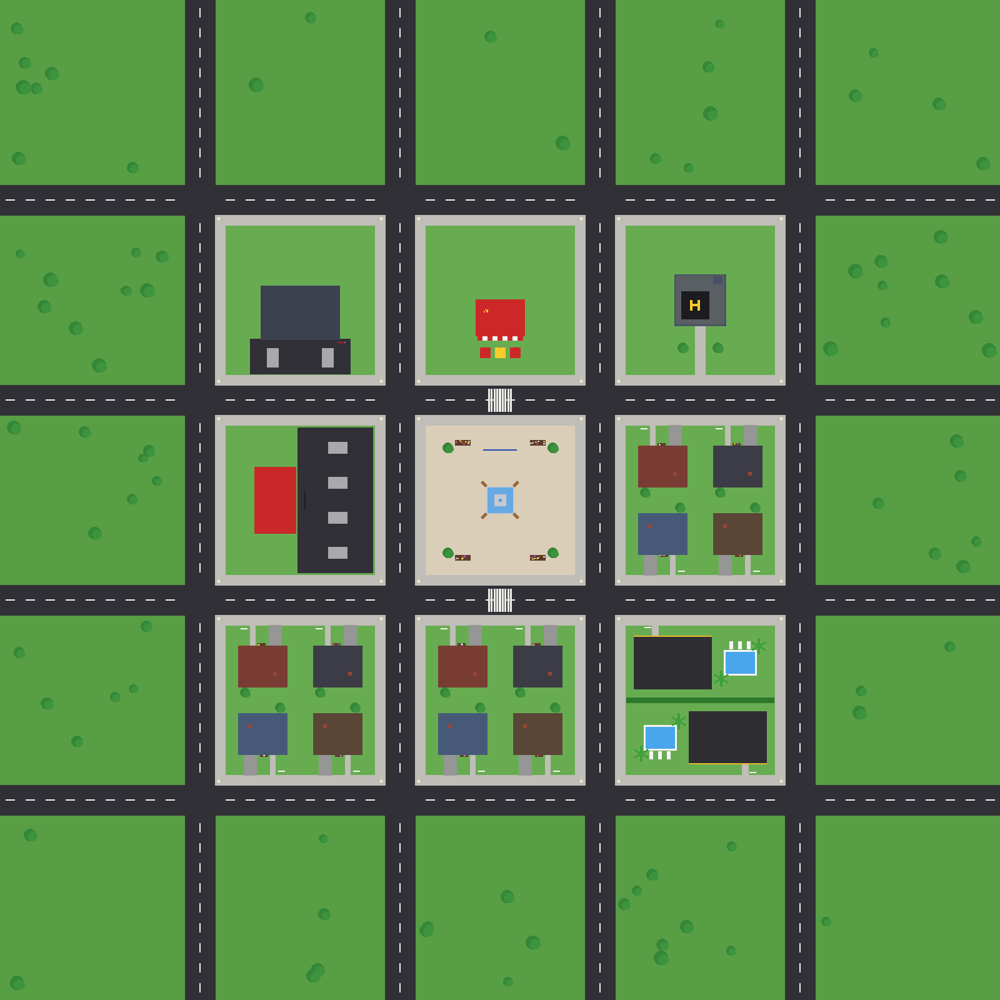

# Zonnestad: een roleplay-spel voor Roblox (zoals Brookhaven)

Een complete roleplay-stad die zichzelf met code bouwt zodra het spel start.



## Wat zit erin?

| | |
|---|---|
| 🛣️ **Stad** | 4×4 wegen met strepen en zebrapaden, stoepen, lantaarns die 's avonds aangaan, en een dag- en nachtritme van 12 minuten |
| ⛲ **Plein** | Fontein met water, bankjes, bloemen en een welkomstbord. Hier verschijn je |
| 👮 **Politiebureau** | Balie (word politie), bureaus, 3 cellen met tralies, parkeerplaats en een Nederlandse vlag |
| 🍟 **Snackbar** | Toonbank met menu (friet, burger, frikandel, cola, ijsje), frituur, terras met parasols en een reuze patatzak op het dak |
| 🏢 **Kantoortoren** | 4 verdiepingen met bureaus, een lift en een helikopterplatform op het dak |
| 🚗 **Autodealer** | Showroom met sportauto's en garages waar je je voertuig kiest |
| 🏠 **12 huizen** | Lindelaan, Eikenweg en Berkenhof, elk met bank, tv, keuken, bed, tuin en brievenbus |
| 👑 **2 villa's** | Met zwembad, palmbomen, ligbedden en luxe inrichting (alleen met Premium) |
| 🚙 **10 voertuigen** | Gezinsauto, pick-up, busje, taxi, scooter, politieauto met zwaailichten, sportwagen, supercar, racemotor en crossmotor, in 8 kleuren |
| 👔 **Rollen** | Burger, Politie, Snackbar-medewerker, Kantoorbaan en Boef, met naambordjes en hoedjes |
| 🚔 **Politie** | Politie kan boeven arresteren. Die zitten dan 45 seconden in de cel |
| 💎 **Robux-winkel** | 3 gamepasses: Premium (villa's en een gouden naam), Sportwagens en Motoren |

### Besturing
- **Menu**: de 4 knoppen links op het scherm (🚗 voertuigen, 🏠 huizen, 👔 banen, 💎 winkel)
- **Rijden**: W/S = gas en remmen, A/D = sturen, spatie = uitstappen
- **In een auto stappen**: loop ernaartoe en druk op **E** ("Instappen")
- **Huis**: druk bij de voordeur op **E** om het te claimen, en daarna om de deur op slot te doen. Jij kunt zelf altijd door je eigen deur
- **Lift in het kantoor**: **E** = omhoog, **R** = omlaag
- **Baan nemen**: **F** bij de balie (politie), het kluisje (snackbar) of de receptie (kantoor)
- **Arresteren** (als politie): houd **F** ingedrukt bij een boef

---

## Zo zet je het in Roblox Studio

### Manier 1: het kant-en-klare bestand (makkelijkst)
1. Download **`Zonnestad.rbxl`** uit deze map.
2. Dubbelklik erop, of open het in Roblox Studio via *File > Open from File*.
3. Druk op **Play** (F5). De stad wordt gebouwd en je verschijnt op het plein.

### Manier 2: met Rojo (als je de code wilt aanpassen)
1. Installeer [Rojo](https://rojo.space) en de Rojo-plugin in Studio.
2. Ga in een terminal naar deze map en typ `rojo serve`.
3. Klik in Studio op de Rojo-plugin en dan op **Connect**.
4. Elke wijziging in `src/` staat meteen in Studio.

Een nieuw `.rbxl` bestand maak je met:
```
rojo build default.project.json -o Zonnestad.rbxl
```

---

## Robux verdienen met gamepasses

Gamepasses werken pas als je spel gepubliceerd is.

1. **Publiceer** je spel: *File > Publish to Roblox*.
2. Ga naar [create.roblox.com](https://create.roblox.com), kies je spel en ga naar **Monetization > Passes**.
3. Maak 3 passes aan: **Premium**, **Sportwagens** en **Motoren**. Upload een plaatje, zet ze **te koop** en kies een prijs.
4. Kopieer van elke pass het **ID** (het getal in de link).
5. Open `src/shared/Config.luau` en vul de ID's in:
   ```lua
   Premium = {
       Id = 123456789, -- <- jouw ID
   ```
6. Publiceer opnieuw.

> 💡 Zolang een ID op `0` staat, krijg je die gamepass **gratis in Studio**. Zo kun je alles testen. In het echte spel staat de knop dan op "nog niet ingesteld".

De prijzen in `Config.luau` worden alleen getoond zolang er nog geen ID is. Daarna leest het spel de echte prijs van Roblox.

---

## Waar staat wat?

```
src/
  shared/
    Config.luau          <- ALLE instellingen: gamepasses, voertuigen, kleuren, rollen, eten
    Remotes.luau         <- communicatie tussen server en speler
  server/
    Main.server.luau     <- start alles op, dag en nacht
    WorldBuilder.luau    <- bouwt de stad (wegen, gebouwen, huizen, meubels)
    VehicleBuilder.luau  <- bouwt de auto's en motoren
    VehicleService.luau  <- spawnen en besturen van voertuigen
    HouseService.luau    <- huizen claimen en deuren op slot
    RoleService.luau     <- banen, teams, naambordjes en hoedjes
    PoliceService.luau   <- arresteren en de cel
    FoodService.luau     <- eten uit de snackbar
    Monetization.luau    <- gamepasses (Robux)
    Build.luau           <- hulpfuncties om onderdelen te bouwen
  client/
    Main.client.luau     <- het menu op je scherm
```

### Zelf dingen toevoegen
- **Nieuw voertuig**: voeg een regel toe aan `Config.Vehicles` en gebruik een bestaande `Style` (Sedan, Pickup, Van, Taxi, Police, Sports, Super, Scooter, Motorbike of Dirtbike).
- **Nieuwe kleur**: voeg een regel toe aan `Config.VehicleColors`.
- **Nieuwe baan**: voeg een regel toe aan `Config.Roles`.
- **Nieuw eten**: voeg een regel toe aan `Config.Food` en een vorm in `FoodService.luau`.
- **Stad aanpassen**: in `WorldBuilder.luau` onderaan, in `WorldBuilder.Build()`.

## Ideeën voor later
Ziekenhuis met ambulance, brandweer, school, supermarkt, telefoon-app, huisdieren, kleding kiezen, meer verdiepingen in huizen, een strand, en geld verdienen met banen.
